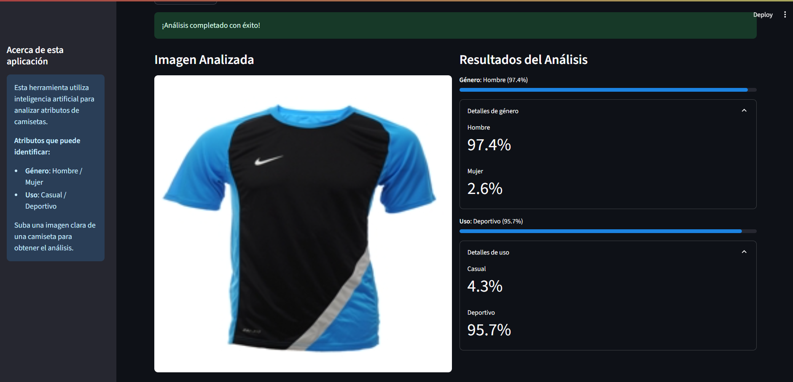
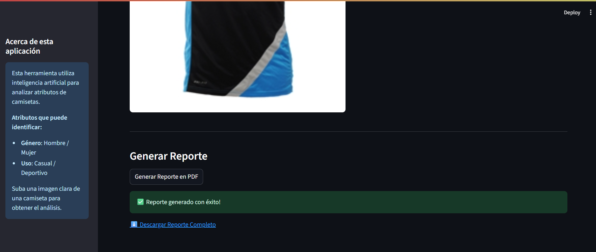
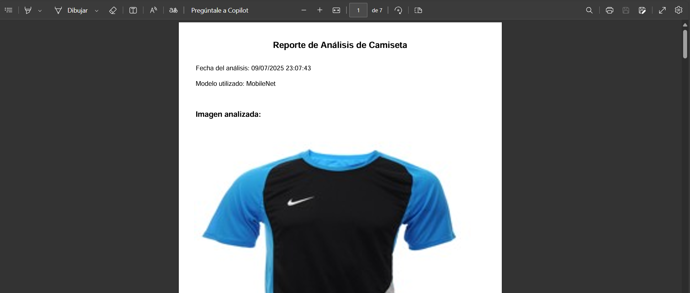

# 👕 Clasificación de Camisetas con Redes Neuronales Convolucionales (CNN)


Este proyecto implementa un sistema automatizado de clasificación de camisetas mediante **redes neuronales convolucionales (CNN)**. Está enfocado en mejorar la **categorización multiatributo** de productos textiles en el **comercio electrónico**, utilizando las arquitecturas **AlexNet, MobileNet y ResNet-50**.

El sistema fue entrenado y evaluado sobre el dataset oficial de Kaggle:  
🔗 [Fashion Product Images Dataset](https://www.kaggle.com/datasets/paramaggarwal/fashion-product-images-dataset)

---

## 📌 Características principales

- ✅ Clasificación de camisetas por imagen
- 🧠 Modelos CNN: AlexNet, MobileNet y ResNet-50
- 📊 Evaluación con precisión, prueba de McNemar y MCC
- 🎯 Clasificación por **género** y por **uso**
- 🌐 Interfaz gráfica amigable desarrollada con **Streamlit**
- 📦 Código abierto y reproducible para uso académico

---

## 🛠️ Tecnologías usadas

- Python 3.11.3
- Visual Studio Code (entorno de desarrollo)
- TensorFlow / Keras
- OpenCV / NumPy / Matplotlib
- scikit-learn
- Streamlit
- Sistema operativo: **Windows 11**

---

## ⚙️ Requisitos del sistema

- Python 3.11.3
- Windows 10 u 11 (también compatible con Linux/Mac)
- Paquetes del archivo `requirements.txt` (ver abajo)

Instalación de dependencias:

```bash
pip install -r requirements.txt
```

---

## 🚀 ¿Cómo ejecutar el proyecto?

Sigue estos pasos para correr el software:

🔗 [Modelos](https://drive.google.com/drive/folders/1cP5LhZmIPMIS12xyV92dohvWlkdaXoUv)

```bash
# 1. Clonar el repositorio
git clone https://github.com/7Kitsu7/proyectoCamisetas.git
cd proyectoCamisetas

# 2. Instalar dependencias
pip install -r requirements.txt

# 3. Descargar
Carpeta model del link "Modelos" y pegar en la raiz del proyecto

# 4. Agregar
Carpeta images del dataset "Fashion Product Images Dataset" en la raiz del proyecto

# 5. Ejecutar la interfaz gráfica
streamlit run app.py
```

Esto abrirá automáticamente una ventana del navegador con la interfaz del sistema, donde podrás cargar imágenes y obtener la predicción de género y uso para camisetas.

---

## 🧪 Ejemplo de uso

A continuación, se muestra la interfaz del sistema ejecutándose en Streamlit:

<p align="center">  </p> <p align="center">  </p> 
<p align="center">  </p> <p align="center">  </p>
