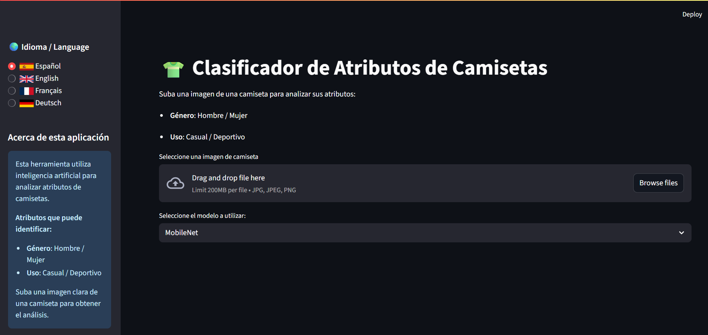
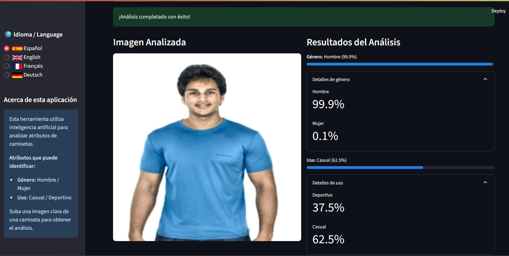
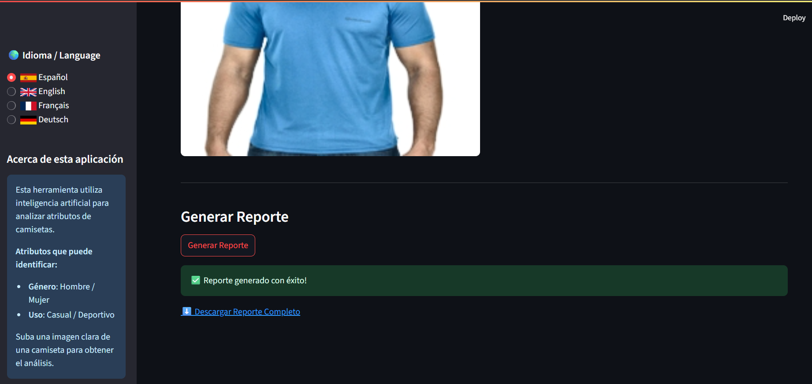
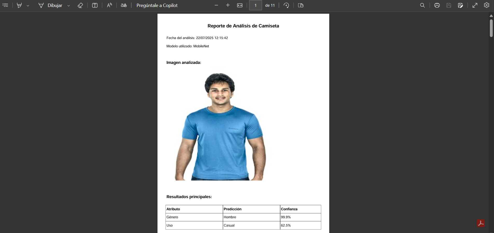

# 👕 Clasificación de Camisetas con Redes Neuronales Convolucionales (CNN)


Este proyecto implementa un sistema automatizado de clasificación de camisetas mediante **redes neuronales convolucionales (CNN)**. Está enfocado en mejorar la **categorización multiatributo** de productos textiles en el **comercio electrónico**, utilizando las arquitecturas **AlexNet, MobileNet, ResNet-50, MobileNetV2+AlexNet y MobileNetV2+ResNet-50**.

El sistema fue entrenado y evaluado sobre el dataset oficial de Kaggle:  
🔗 [Fashion Product Images Dataset](https://www.kaggle.com/datasets/paramaggarwal/fashion-product-images-dataset)

---

## 📌 Características principales

- ✅ Clasificación de camisetas por imagen
- 🧠 Modelos CNN: AlexNet, MobileNet, ResNet-50, MobileNetV2+AlexNet y MobileNetV2+ResNet-50
- 📊 Evaluación con precisión, prueba de McNemar y MCC
- 🎯 Clasificación por **género** y por **uso**
- 🌐 Interfaz gráfica amigable desarrollada con **Streamlit**
- 📦 Código abierto y reproducible para uso académico
  
---

## 📚 Justificación y Contexto Técnico

El comercio electrónico en el ámbito de la moda ha revolucionado la industria textil, generando la necesidad de una gestión automatizada de productos en inventarios y catálogos extensos. Estudios como Chugh y Jain (2024) señalan que esta tecnología está alterando las prácticas logísticas y las recomendaciones de productos en grandes corporaciones como Amazon, H&M y Shein.

Igualmente, Kempele (2023) menciona que las camisetas, al ser una de las prendas más populares y adaptables, constituyen un sector importante dentro del vestuario casual a nivel mundial. Se proyecta que el mercado global de camisetas llegará a los 46 990 millones de dólares en 2025 y podría incrementarse hasta los 52 800 millones para 2029. En 2023, las importaciones mundiales de camisetas se estimaron en 44 930 millones de USD, lo que resalta su impacto en el comercio global de ropa.

La adecuada clasificación de estos productos influye directamente en la experiencia del usuario, la eficacia de las operaciones y el beneficio económico de las plataformas de comercio electrónico.

Por otro lado, Archana y Jeevaraj (2024) afirman que los avances en inteligencia artificial aplicada a la clasificación de productos de moda han sido significativos en la última década. Las técnicas tradicionales basadas en descriptores manuales como SIFT, HOG y LBP han sido superadas por métodos de aprendizaje profundo, en particular las redes neuronales convolucionales (CNN). Abbas et al. (2024) demostraron que estas redes, utilizando arquitecturas como ResNet-50 y EfficientNet-B0, pueden alcanzar precisiones superiores al 90 % en la clasificación de prendas en entornos reales de e-commerce.

Sin embargo, la mayoría de las investigaciones se centran en clasificaciones de categorías únicas (tipo, color o género), lo que limita su aplicación en sistemas reales que requieren predicción de múltiples atributos simultáneamente. Guo et al. (2019) destacan esta limitación en datasets convencionales, en comparación con conjuntos como iMaterialist, que contienen múltiples etiquetas detalladas por imagen.

Zhang et al. (2020) mencionan que arquitecturas como ResNeSt, que introducen mecanismos de atención (Split-Attention), han alcanzado un top-1 accuracy de 81.13 % en ImageNet, superando a ResNet estándar en clasificación de moda. A su vez, los Vision Transformers (ViT) han logrado precisiones superiores al 95 % en datasets como Fashion-MNIST, incluso superando a CNNs tradicionales como ResNet-50 (84.5 %) (Abd Alaziz et al., 2023).

La clasificación automática de camisetas en escenarios reales enfrenta retos importantes. Liang et al. (2023) señalan que la alta variabilidad en imágenes —fondos, iluminación, poses, etc.— afecta significativamente el desempeño de los modelos. Además, Reddi et al. (2019) destacan que para entornos productivos se requiere una inferencia inferior a 50 ms por imagen, lo que impone restricciones al tipo de arquitectura a utilizar.

Finalmente, LeCun et al. (2015) afirman que las redes neuronales convolucionales son capaces de aprender automáticamente características visuales relevantes, eliminando la necesidad de extracción manual de características, y permitiendo adaptabilidad frente a la variabilidad visual de productos reales.

---

## 🛠️ Tecnologías usadas

- Python 3.11.3
- Visual Studio Code (entorno de desarrollo)
- TensorFlow / Keras
- OpenCV / NumPy / Matplotlib
- scikit-learn
- Streamlit
- Sistema operativo: **Windows 11**

---

## ⚙️ Requisitos del sistema

- Python 3.11.3
- Windows 10 u 11 (también compatible con Linux/Mac)
- Paquetes del archivo `requirements.txt` (ver abajo)

Instalación de dependencias:

```bash
pip install -r requirements.txt
```

---

## 🚀 ¿Cómo ejecutar el proyecto?

Sigue estos pasos para correr el software:

🔗 [Modelos](https://drive.google.com/drive/folders/1cP5LhZmIPMIS12xyV92dohvWlkdaXoUv)

```bash
# 1. Clonar el repositorio
git clone https://github.com/7Kitsu7/proyectoCamisetas.git
cd proyectoCamisetas

# 2. Instalar dependencias
pip install -r requirements.txt

# 3. Descargar
Carpeta model del link "Modelos" y pegar en la raiz del proyecto

# 4. Agregar
Carpeta images del dataset "Fashion Product Images Dataset" en la raiz del proyecto

# 5. Ejecutar la interfaz gráfica
streamlit run app.py

```

Esto abrirá automáticamente una ventana del navegador con la interfaz del sistema, donde podrás cargar imágenes y obtener la predicción de género y uso para camisetas.

---

## 🧪 Ejemplo de uso

A continuación, se muestra la interfaz del sistema ejecutándose en Streamlit:

<p align="center">  </p> <p align="center">  </p> 
<p align="center">  </p> <p align="center">  </p>

---

## 🚀 Prueba el software ahora  

[Abrir programa](https://clasificador-camisetas.streamlit.app/)


---

## 📝 Referencias

Abbas, W., Zhang, Z., Asim, M., Chen, J., & Ahmad, S. (2024). Ai-driven precision clothing classification: Revolutionizing online fashion retailing with hybrid two-objective learning. Information, 15(4), 196. https://doi.org/10.3390/info15040196 

Abd Alaziz, H. M., Elmannai, H., Saleh, H., Hadjouni, M., Anter, A. M., Koura, A., & Kayed, M. (2023). Enhancing fashion classification with vision transformer (ViT) and developing recommendation fashion systems using DINOVA2. Electronics, 12(20), 4263. https://doi.org/10.3390/electronics12204263

Archana, R., & Jeevaraj, P. E. (2024). Deep learning models for digital image processing: a review. Artificial Intelligence Review, 57(1), 11. https://doi.org/10.1007/s10462-023-10631-z

Chugh, P., & Jain, V. (2024). Artificial Intelligence Empowerment in E-Commerce: A Bibliometric Voyage. Journal of Contemporary Retail and E-Business, advance online publication. https://doi.org/10.1177/09711023241303621

Guo, S., Huang, W., Zhang, X., Srikhanta, P., Cui, Y., Li, Y., ... & Belongie, S. (2019). The imaterialist fashion attribute dataset. In Proceedings of the IEEE/CVF international conference on computer vision workshops (pp. 0-0). https://doi.org/10.48550/arXiv.1906.05750  

Ķempele, S. (2023). 20 T-Shirt industry statistics and trends. Printful Blog. https://www.printful.com/blog/t-shirt-industry-statistics

LeCun, Y., Bengio, Y., & Hinton, G. (2015). Deep learning. Nature, 521(7553), 436–444. https://doi.org/10.1038/nature14539  

Liang, J., Liu, Y., & Vlassov, V. (2023). The impact of background removal on performance of neural networks for fashion image classification and segmentation. arXiv. https://doi.org/10.48550/arXiv.2308.09764

Reddi, V. J., Cheng, C., Kanter, D., …, & Zhong, A. (2019). MLPerf Inference Benchmark. arXiv. https://doi.org/10.48550/arXiv.1911.02549

Zhang, H., Wu, C., … Li, M. & Smola, A. (2020). ResNeSt: Split-Attention Networks. arXiv. 
https://doi.org/10.48550/arXiv.2004.08955

